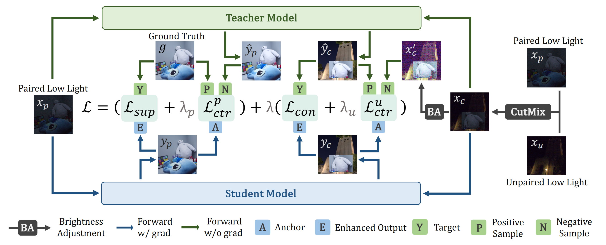

# Semi-supervised Low-Light Image Enhancement: When Mean Teacher Meets Contrastive Learning
#### Arxiv, 2025

[Zhangkai Ni](https://eezkni.github.io/)<sup>1</sup>, Menglin Han<sup>1</sup>, [Wenhan Yang](https://flyywh.github.io/)<sup>2</sup>, [Hanli Wang](https://scholar.google.com/citations?user=WioFu64AAAAJ&hl=zh-CN)<sup>1</sup>, Lin Ma<sup>3</sup>, [Sam Kwong](https://scholar.google.com/citations?user=_PVI6EAAAAAJ&hl=zh-CN)<sup>4</sup>

<sup>1</sup>Tongji University, <sup>2</sup>Peng Cheng Laboratory, <sup>3</sup>Meituan, <sup>4</sup>Lingnan Univerity

This repository provides the official implementation for the paper "Semi-Supervised Low-Light Image Enhancement: When Mean Teacher Meets Contrastive Learning," Arxiv, 2025. 
<!-- [Paper](https://arxiv.org/abs/2506.11823) -->



### Updates
[2025-06-28] The test codes, pre-trained weights and datsets are provided in this repository, while the training codes will be released upon acceptance of the manuscript.

## About SSLL

Images captured under low-light conditions often suffer from complex degradations, including under-exposure, noise, and low contrast, posing significant challenges for visual enhancement. 
Existing low-light enhancement methods, whether fully supervised or unpaired/self-supervised, exhibit distinct advantages and limitations. 
Supervised approaches effectively suppress noise and preserve fine details but suffer from limited generalization due to heavy reliance on paired training data, which is costly to obtain and often restricted to limited scenes.
In contrast, unpaired or self-supervised methods leverage readily available unpaired data, excelling at capturing global illumination and color distribution with better adaptability and generalization. 
However, they typically struggle with precise color fidelity and detail restoration owing to the absence of ground-truth references.
In this paper, we propose a unified Mean-Teacher framework that progressively integrates the complementary knowledge from paired and unpaired data to achieve enhanced illumination and color rendition alongside noise suppression. 
Specifically, our approach enriches learning at both data and loss levels: training data are augmented via CutMix between paired and unpaired domains, and a novel risk-theory-based contrastive learning strategy is introduced to extract rich supervisory signals from mixed data regions. 
Extensive experiments on both paired (in-domain) and unpaired (cross-domain) test sets demonstrate that our method significantly outperforms baseline models and state-of-the-art techniques.

**TL;DR:** We propose a novel Semi-Supervised Low-Light Image Enhancement (SSLL) Framework, jointly learning visual priors from paired and unpaired data within a unified Mean-Teacher architecture, guided by an innovative Pixel Intermediate Contrastive Loss (PICo Loss) derived from empirical risk boundary analysis to provide richer and more effective supervision.


## Experimental Results

The radar figures of performance improvements achieved by proposed SSLL across multiple LLIE models.

<div align="center">  </div>

The detail average PSNR, SSIM, and LPIPS performance of seven backbone networks across the LOLv2, SID, SDSD, SMID, and LSRW-Huawei datasets. Among the 105 results, 93.3\% are improved by SSLL, with the improved results $\Delta$ highlighted in <font color="#FF0000">red</font>.

<div align="center">  </div>


## Environment setup
To start, we prefer creating the environment using conda:
```sh
conda create -n ssll
conda activate ssll
pip install -r requirements.txt
```

[Pytorch](https://pytorch.org/) installation is machine dependent, please install the correct version for your machine.

<!-- <details>
  <summary> Dependencies (click to expand) </summary>

  - `PyTorch`, `numpy`: main computation.
  - `pytorch-msssim`: SSIM calculation.
  - `tqdm`: progress bar.
  - `opencv-python`,`scikit-image`: image processing.
  - `imageio`: images I/O.
  - `einops`: torch tensor shaping with pretty api.
  - `PyYAML`: parsing and generating YAML files.
</details> -->

## Getting the data
The [LOLv2](https://github.com/flyywh/CVPR-2020-Semi-Low-Light) and [SID](https://github.com/cchen156/Learning-to-See-in-the-Dark) are mainly used as the paired set and unpaired set in our paper and these datasets are also used:

- [SDSD](https://github.com/dvlab-research/SDSD)
- [SMID](https://github.com/cchen156/Seeing-Motion-in-the-Dark)
- [LSRW-Huawei](https://github.com/JianghaiSCU/R2RNet)

We processed some datasets to fit our training code.
The used datasets (except SMID) are available at [GoogleDrive](https://drive.google.com/drive/folders/1JAos68FGnaQeGf3hPRt_al6byR_oK_wn?usp=sharing) and [BaiduYun](https://pan.baidu.com/s/1yXjvmDSwO0cOH8XBlkFQVg)(extract code: `wwcx`).

We follow RetinexFormer to use SMID, which is available at [GitHub](https://github.com/caiyuanhao1998/Retinexformer).

## Getting the pre-trained checkpoints
We provide the baseline checkpoints trained using a purely supervised method, as well as the SSLL checkpoints trained within our proposed semi-supervised framework, for the 7 backbones (Restormer, NAFNet, UNet, LLFormer, RetinexFormer, MIRNet, CIDNet) discussed in our paper.

Checkpoints are available at [GoogleDrive](https://drive.google.com/drive/folders/1LjNlUVAcHD80yvx1R1fNyUoBss02MClQ?usp=sharing) and [BaiduYun](https://pan.baidu.com/s/1jbIK8UGT2J2odwaMRjdnAA)(extract code: `eimu`).

<!-- | Backbone | Baseline | SSLL |
| --- | --- | --- |
| Restormer | [GoogleDrive](https:) [BaiduYun](https:) | [GoogleDrive](https:) [BaiduYun](https:) |
| NAFNet | [GoogleDrive](https:) [BaiduYun](https:) | [GoogleDrive](https:) [BaiduYun](https:) |
| UNet | [GoogleDrive](https:) [BaiduYun](https:) | [GoogleDrive](https:) [BaiduYun](https:) |
| LLFormer | [GoogleDrive](https:) [BaiduYun](https:) | [GoogleDrive](https:) [BaiduYun](https:) |
| RetinexFormer | [GoogleDrive](https:) [BaiduYun](https:) | [GoogleDrive](https:) [BaiduYun](https:) |
| MIRNet | [GoogleDrive](https:) [BaiduYun](https:) | [GoogleDrive](https:) [BaiduYun](https:) |
| CIDNet | [GoogleDrive](https:) [BaiduYun](https:) | [GoogleDrive](https:) [BaiduYun](https:) | -->


## Running the model
### Training
The training codes will be available as the manuscript is accepted.

### Testing
#### Testing with public datasets
1. Prepare the testing datasets.
2. Prepare the pre-trained checkpoint file.
3. Modify the relevant paths in the `get_dataset` function located in the  `common_utils/evaluation/eval.py` script.
4. Modify the `RESULT_DIR` path in `common_utils/evaluation/eval.py` script, this dir will store the logs and results.
5. Run the following commands for tesing (the flag `--save` is optional and can be used to save the result images):
```bash
# test one backbone (Restormer for example) on single dataset (LOLv2 for example)
$ python common_utils/evaluation/eval.py --network Restormer --weight PATH_OF_CHECKPOINT --dataset LOLv2
# test one backbone (Restormer for example) on all five datasets
$ python common_utils/evaluation/eval.py --network Restormer --weight PATH_OF_CHECKPOINT --dataset all
```

The IQA results and image results will be in the path specified by `RESULT_DIR` in `common_utils/evaluation/eval.py` script.

#### Infer using any images
1. Prepare the input image or a set of images (all placed directly within a single directory).
2. Prepare the pre-trained checkpoint file.
3. Run the following commands for infering (the flag `--fast-eval` is optional and can be used to enable Auto Mix-Precision to speed up infering):
```bash
# infer on one image
$ python common_utils/evaluation/eval_with_any_backbone.py --network NETWORK_TYPE --weight PATH_OF_CHECKPOINT --image PATH_OF_IMAGE_FILE --output PATH_OF_OUTPUT_DIR
# infer on a image set
$ python common_utils/evaluation/eval_with_any_backbone.py --network NETWORK_TYPE --weight PATH_OF_CHECKPOINT --set PATH_OF_IMAGE_SET_DIR --output PATH_OF_OUTPUT_DIR
```

The output image(s) will be stored in the `--output` specified directory.

## Citation
If you find our work useful, please cite it as
```
@article{ni2025ssll,
  title={Semi-supervised Low-Light Image Enhancement: When Mean Teacher Meets Contrastive Learning},
	author={Ni, Zhangkai, and Han, Menglin, and Yang, Wenhan, and Wang, Hanli, and Ma, Lin and Kwong, Sam},
	journal={Arxiv},
	volume={},
	pages={},
	year={2025},
	publisher={Arxiv}
}
```

## Acknowledgments
This code is inspired by [Palette](https://github.com/Janspiry/Palette-Image-to-Image-Diffusion-Models). We thank the authors for the nicely organized code!


## Contact
Thanks for your attention! If you have any suggestion or question, feel free to leave a message here or contact Dr. Zhangkai Ni (eezkni@gmail.com).


<!-- ## License
[MIT License](https://opensource.org/licenses/MIT) -->
